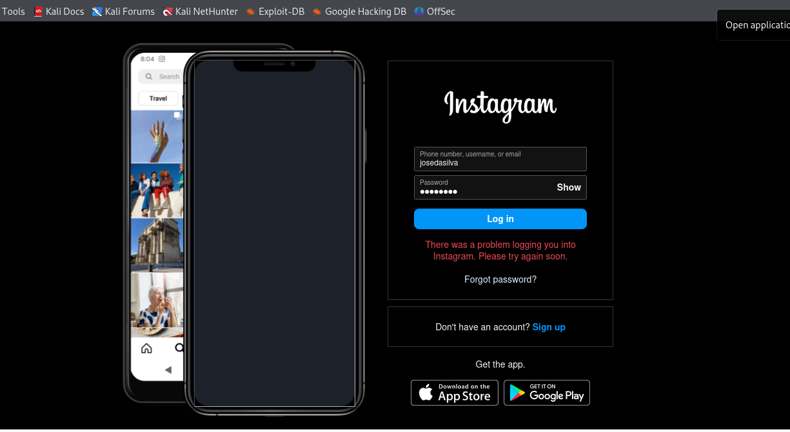

# Desafio-Phishing

Este repositório documenta os passos para configurar um ataque de phishing simulado utilizando o **Social-Engineer Toolkit (SET)**. O objetivo é demonstrar o processo para fins educativos e de cibersegurança. Siga as etapas abaixo cuidadosamente.

## Passos

### 1. Acesso Root
Para garantir permissões adequadas no sistema:
```bash
sudo su
```

### 2. Iniciando o Social-Engineer Toolkit (SET)
Execute o comando abaixo para iniciar o **SET**:
```bash
setoolkit
```

### 3. Tipo de Ataque: Social-Engineering Attacks
Selecione a opção de ataques baseados em engenharia social no menu principal do **SET**.

### 4. Vetor de Ataque: Web Site Attack Vectors
Escolha a opção para realizar ataques usando vetores de site.

### 5. Método de Ataque: Credential Harvester Attack Method
Selecione o método **Credential Harvester** para capturar credenciais.

### 6. Método de Ataque: Site Cloner
Opte pelo **Site Cloner**, que permite clonar um site real para o ataque de phishing.

### 7. Obtendo o Endereço da Máquina
Obtenha o endereço IP da sua máquina local usando o comando:
```bash
ifconfig
```

### 8. URL para Clone
Insira a URL do site que deseja clonar. Neste exemplo, estamos utilizando o Instagram:
```
http://www.instagram.com
```
### Resultado:

## Imagem do site clone



## Imagem do servidor capturando o alvo


## Aviso de Segurança

Este repositório foi criado exclusivamente para fins educativos e de conscientização sobre cibersegurança. **Não é permitido o uso deste conteúdo para fins maliciosos ou ilegais.**

Qualquer uso indevido do material aqui descrito é de inteira responsabilidade do usuário. Sempre respeite as leis e regulamentos locais relacionados à segurança da informação e privacidade.

